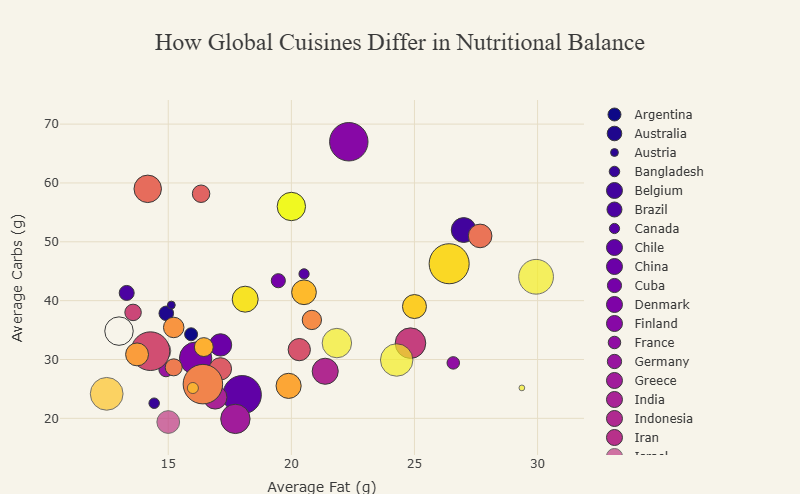
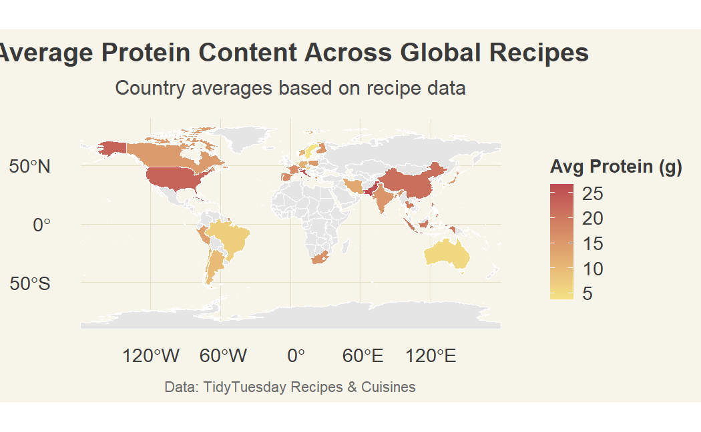
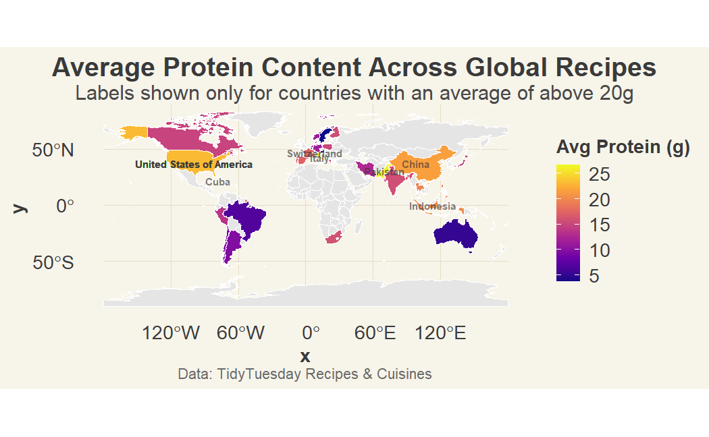

# Data Visualization and Reproducible Research

> Isabel Majdoch 


The following is a sample of products created during the _"Data Visualization and Reproducible Research"_ course.


## Project 01

In the `project_01/` folder you can find reasearch to determine which genres and story types are the most financially successful in Hollywood movies. 

**Sample data visualization:** 

My favorite visualization, a Heatmap that shows profitiability by genre and story. 


Top performers included:

1. **Monster Force - Drama**  
2. **Wretched Excess - Drama**  
3. **Journey and Return - Drama**  
4. **Maturation - Biography**  
5. **Monster Force - Horror**

#### Accessibility Example

Within the heatmap, you also are able to see where **accessability** is present throughout the revised project. 

```
{r, fig.alt="Heatmap showing average profitability for each combination of genre and story type, with darker colors indicating higher ROI."}
heat_data <- movie %>%
  group_by(Genre, Story) %>%
  summarise(
    avg_profit = mean(Profitability, na.rm = TRUE),
    n = n()
  ) %>%
  filter(n >= 3)

ggplot(heat_data, aes(x = Genre, y = Story, fill = avg_profit)) +
  geom_tile(color = "white", linewidth = 0.4) +
  scale_fill_viridis_c(option = "C", direction = -1) +
  labs(
    title = "Profitability Heatmap by Genre and Story",
    subtitle = "Darker colors indicate higher average ROI",
    x = "Genre",
    y = "Story",
    fill = "Avg ROI"
  ) +
  theme_isabel() +
  theme(
    axis.text.x = element_text(angle = 45, hjust = 1),
    panel.grid = element_blank()
  )
```

- Colorblind‑safe palettes (viridis everywhere)
- Alt text for every figure
- No meaning encoded by color alone

#### Redesign a bad chart (before / after)

<table>
  <tr>
    <td></td>
    <td></td>
  </tr>
  <tr>
    <td align="center"><strong>Before</strong></td>
    <td align="center"><strong>After</strong></td>
  </tr>
</table>

The redesigned version improves clarity by:

- Using a perceptually uniform palette
- Adding percentage labels
- Sorting genres by frequency
- Applying a consistent theme

#### Interactive Graph


The viewer can hover over each bubble to reveal exact values for profitability, opening weekend revenue, and budget. This makes it possible to compare genres more precisely, inspect outliers, and understand the underlying numbers without cluttering the visual with labels. Interactivity also allows the reader to focus on specific points of interest rather than interpreting everything at once, which improves clarity and engagement.

---

## Project 02

In this project, I explored how different types of recipes around the world's micro nutrients (protien, fats, and carbs) compare. Find the code and report in the `project_02/` folder.

**Sample data visualization:** 

My favority visualization is the interactive bubble graph that shows the carb, protien, and fat content per average cuisine.



With a static image chart you wouldn't be able to get all of those details and it would be significantly more difficult to tell the difference between the different countries. 

#### Accessibility Example

Within the revised graphs in Project 2, you also are able to see where **accessability** is present throughout the revised project.

- **Accessibility**: Added alt text to all figures and replaced custom palettes with colorblind‑safe viridis scales.
- **Theme revision**: Updated the custom theme to ensure consistent contrast and readability.

```
library(viridis)

theme_foodie_cb <- function(base_size = 14) {
  theme_minimal(base_size = base_size) %+replace%
    theme(
      plot.background  = element_rect(fill = "#F7F4EA", color = NA),
      panel.background = element_rect(fill = "#F7F4EA", color = NA),
      legend.background = element_rect(fill = "#F7F4EA", color = NA),

      panel.grid.major = element_line(color = "#E6DDC6", linewidth = 0.4),
      panel.grid.minor = element_line(color = "#EFE8D8", linewidth = 0.2),

      plot.title = element_text(face = "bold", size = base_size * 1.4, color = "#3A3A3A"),
      plot.subtitle = element_text(size = base_size * 1.1, color = "#4A4A4A"),
      plot.caption = element_text(size = base_size * 0.8, color = "#6A6A6A"),

      axis.title = element_text(face = "bold", color = "#3A3A3A"),
      axis.text  = element_text(color = "#3A3A3A"),

      legend.title = element_text(face = "bold", color = "#3A3A3A"),
      legend.text  = element_text(color = "#3A3A3A"),

      strip.background = element_rect(fill = viridis(1, option = "C"), color = NA),
      strip.text = element_text(face = "bold", color = "#3A3A3A")
    )
}
```

#### Redesign a bad chart (before / after)

<table>
  <tr>
    <td></td>
    <td></td>
  </tr>
  <tr>
    <td align="center"><strong>Before</strong></td>
    <td align="center"><strong>After</strong></td>
  </tr>
</table>

The revisions provide better accessibility wise, with the color palette being easier to read for color blind and providing alt text. It also labels the countries with the most protein content, naming them, for better readability. Also the title is centered so it can be properly read.

---

## Project 03

In this project, I explored ... _[short description of the data visualizations you for this part of the project produced goes here]_

**Sample data visualization:** 

_[include your favorite visualization from this project here]_


### Moving Forward

_Please add here a short reflection on what you learned and what you plan to continue exploring in terms of data visualization, data storytelling, reproducible research, and/or related topics._
